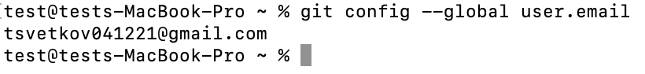

# LR6
## Лабораторная работа №6

Цель лабораторной работы: изучение базовых возможностей системы управления версиями, опыт работы с Git Api, опыт работы с локальным и удаленным репозиторием.

1. Ввел имя пользователя и почту

2. Клонировал репозиторий

3. Создал файл через интерфейс GitHub

4. Подтянул изменения в локальный репозиторий

5. Получил историю операций для каждой из веток

6. Посмотрел последнее изменение

7. Выполнил слияние в ветку master

8. Решил проблему слияния

9. Удалил побочную ветку

10. Сделал изменения и зафиксировал три раза

11. Удаление коммитов

12. Получение истории операций в форматированном виде

13. Создание ветки для отчета

14. Лог всех команд:

14.1 git config - настройки

14.2 git clone - клонирование репозитория

14.3 git pull - используется для извлечения и загрузки содержимого из удаленного репозитория

14.4 git log - используется для просмотра истории коммитов

14.5 git show - используется для просмотра подробных данных об объектах Git

14.6 git merge - объединяет несколько последовательностей коммитов в общую историю

14.7 git push - передаёт в удалённой репозиторий изменения, сделанные в локальном репозитории

14.8 git status - показывает состояние файла в рабочем каталоге

14.9 git add - перенос ожидающих изменений из рабочего каталога в раздел проиндексированных файлов GIT

14.10 git commit - делает для проекта снимок текущего состояния изменений, добавленных в раздел проиндексированных файлов

14.11 git reset - служит для отмены локальных изменений в разделе проиндексированных файлов и рабочем каталоге

## Вывод: изучили базовые возможности системы управления версиями, получили опыт работы с Git Api и опыт работы с локальным и удаленным репозиторием.
